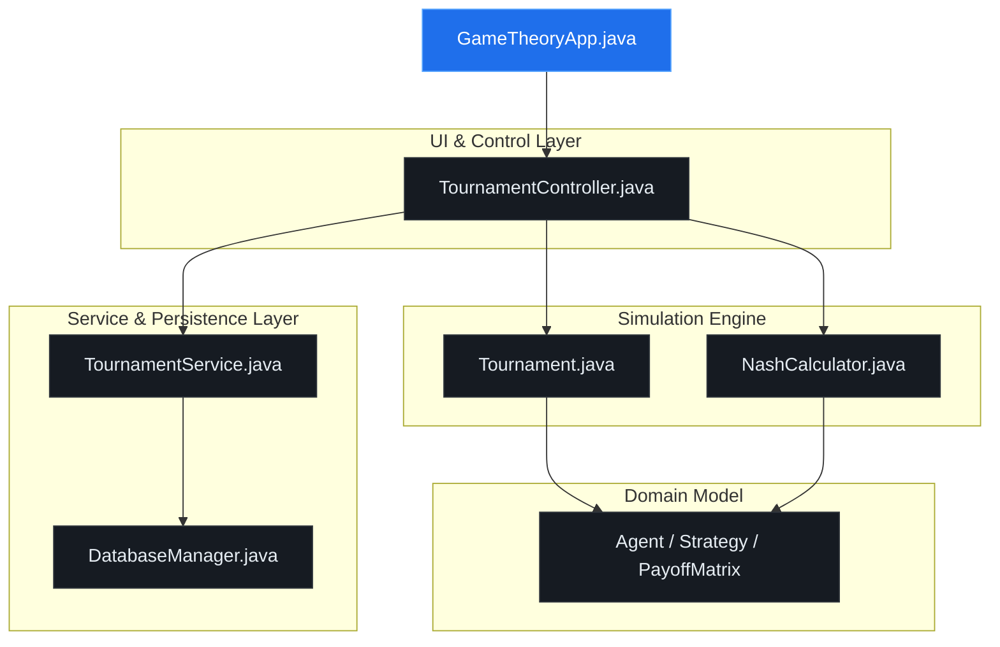
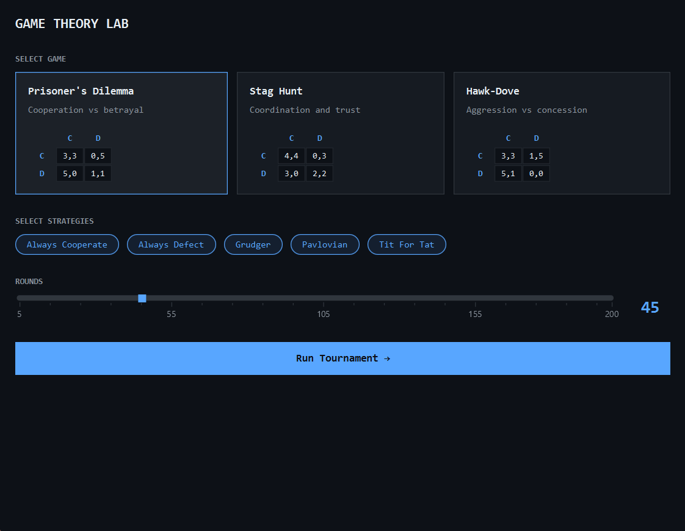
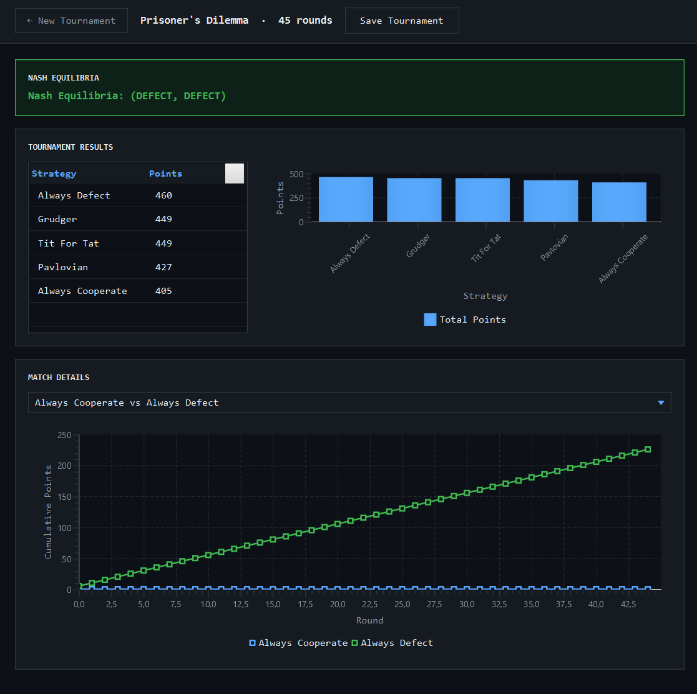
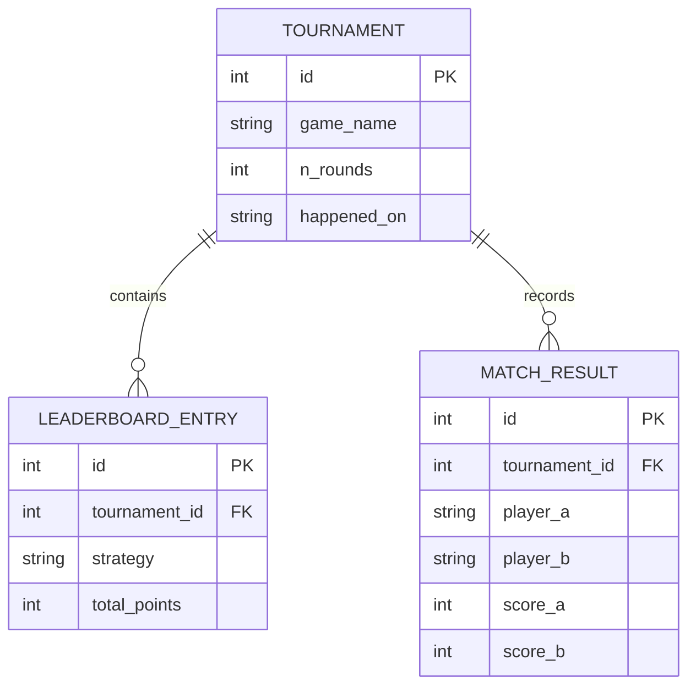

# Game Theory Lab

An interactive JavaFX desktop application designed to simulate, analyze, and visualize iterated strategic tournaments between autonomous agents executing classic Game Theory strategies. The engine also computes Pure Nash Equilibria for the selected game matrices and persists historical results via SQLite.

## 🚀 Features

* **Multi-Game Simulation Environment:** Supports customizable runs for classic symmetric $2 \times 2$ games: *Prisoner's Dilemma*, *Stag Hunt*, and *Hawk-Dove*.
* **Algorithmic Analysis:** Real-time computation of **Pure Nash Equilibria** using automated best-response matrix scanning.
* **Diverse Strategy Pool:** Polymorphic agents implementing distinct behaviors:
    * `Always Cooperate` / `Always Defect` (Baseline behavior)
    * `Tit For Tat` (Reciprocal fairness)
    * `Grudger` (Permanent retaliation upon betrayal)
    * `Pavlovian` (Win-stay, lose-shift heuristic)
* **Advanced Visualizations:** Dynamic rendering of tournament leaderboards via JavaFX `BarChart` and round-by-round cumulative score tracking using `LineChart`.
* **Persistence Layer:** Embedded SQLite database to archive tournament statistics, exact match pairings, and final standings.
* **Modern UI/UX:** Dark-mode interface built with decoupled JavaFX FXML and highly customized CSS styling mimicking the structural GitHub aesthetic.

---

## 🛠️ Architecture & Design Patterns

The project follows a decoupled **MVC (Model-View-Controller)** structural pattern engineered for high extensibility:



### Strategic Polymorphism
Every strategy implements the `Strategy` interface and extends the abstract base class `Agent`. This allows the tournament engine to run seamless round-robin simulations without knowing the underlying operational rules of the competing entities:

---

## 📐 Mathematical Formulation

The simulation solves for Nash Equilibria dynamically. A strategy profile is a **Pure Nash Equilibrium** if no player can unilaterally deviate to increase their payoff.
The `NashCalculator` processes the instantiated `PayoffMatrix` arrays, executing cross-directional best-response validations for both actors to output exact operational equilibria coordinates on the UI interface.

---

## 📸 Screenshots & UI Flow

### 1. Configuration Panel
Set up the simulation parameters by selecting the game type, active strategies, and total tournament rounds.



### 2. Tournament Analytics View
Review the final leaderboard ranking alongside the visual progression of cumulative scores across individual rounds.



---

## 🗄️ Database Schema

The persistence layer maps tournament execution metadata using three normalized relational tables within an embedded SQLite instance:



## 🔧 Getting Started

### Prerequisites
* **Java JDK 21** or higher
* **Maven** or **Gradle** setup configured for JavaFX 21+
* SQLite JDBC Driver compatible dependencies

### Installation & Run
1. Clone the repository:
   
   ```bash
   git clone [https://github.com/SydBrain/game_theory_lab.git](https://github.com/SydBrain/game_theory_lab.git)
   cd game_theory_lab
   ```
   
2. Build and launch using Maven:
   
   ```bash
   mvn clean javafx:run
   ```
